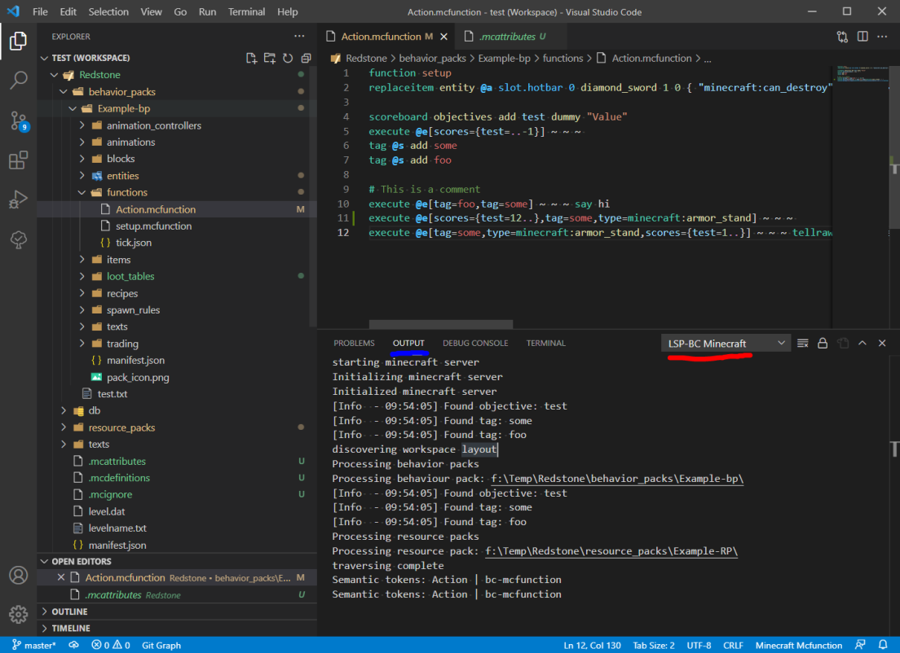

# Console

A nesscary part is to check if the extension is activated, or not outputting hunderds of errors.

## Steps

1. Press `ctrl + shift + u` to open the output window, or `ctrl + J` to open the terminal.
2. Make sure you are on the blue part (see image) of the window that now appears. This is the output window.
3. On the right side of the screen (red part in the image) check if you in those options can find `LSP-BC Minecraft`

if `LSP-BC minecraft` is there then the extension has been activated. if its missing it not activated.

4. If any line in the output windows start with: `[Error`. Then the plugin has trouble with a certain part of its programming or the contents of files.
